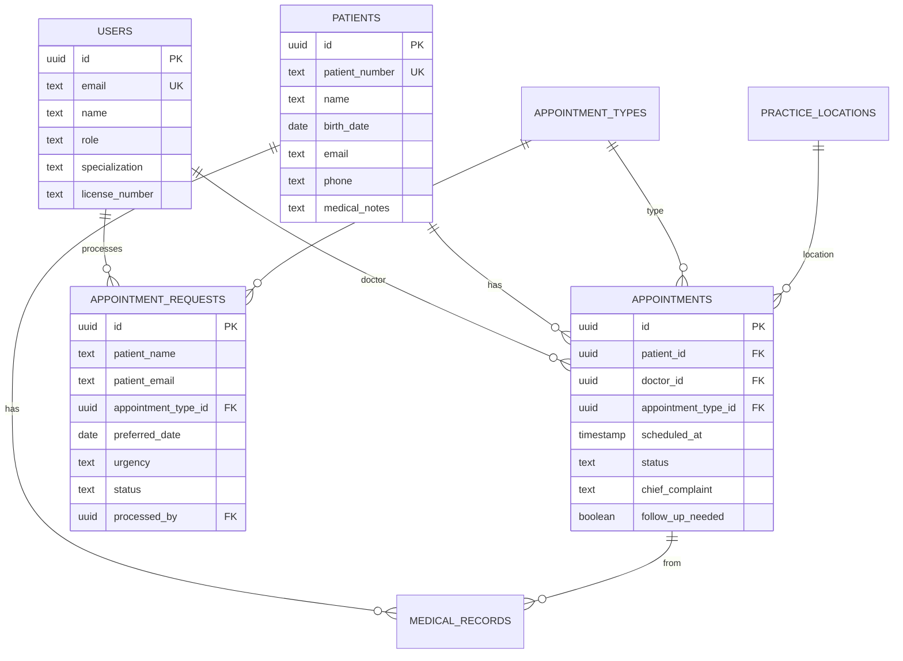

# Werkproces 2 & 3 Verslag: MedCheck+ Medische Praktijk Portal

**Datum:** 27 juni 2025  
**Project:** MedCheck+ - Medische Praktijk Management Systeem  
**Ontwikkelaar:** qdela  
**Technologie Stack:** Next.js 15, React 18, TypeScript, Supabase (PostgreSQL), Tailwind CSS

---

## 📋 Inhoudsopgave

1. [Project Overzicht](#project-overzicht)
2. [Werkproces 2: Automatiseert Processen](#werkproces-2-automatiseert-processen)
3. [Werkproces 3: Beheert Databases](#werkproces-3-beheert-databases)
4. [Technische Implementatie](#technische-implementatie)
5. [Conclusie](#conclusie)

---

## 🏥 Project Overzicht

MedCheck+ is een volledig functioneel medisch praktijk management portaal dat patiënten in staat stelt om online afspraken te maken en artsen/assistentes helpt bij het beheren van hun praktijk. Het systeem demonstreert uitstekend **Werkproces 2 (Automatiseert processen)** en **Werkproces 3 (Beheert databases)**.

### Kernfunctionaliteiten:
- ✅ **Patiënt Portal**: Online afspraken maken, medische geschiedenis bekijken
- ✅ **Medisch Dashboard**: Afspraakverzoeken beheren, patiëntendossiers, agenda overzicht
- ✅ **Admin Portal**: Gebruikersbeheer, systeeminstellingen
- ✅ **Automatische Processen**: Formulierverwerking, statustracking, notificaties
- ✅ **Database Management**: Volledige CRUD operaties, relationele queries, data integriteit

---

## 🤖 Werkproces 2: Automatiseert Processen

### 2.1 Automatische Afspraakverwerking

**Proces Flow:**
1. **Patiënt vult afspraakformulier in** (publiek toegankelijk)
2. **Systeem valideert automatisch** alle invoergegevens
3. **Database opslag** met automatische timestamps
4. **Status tracking** (pending → approved → scheduled)
5. **Notificaties** naar medisch personeel
6. **Automatische bevestigingsemails** (klaar voor SendGrid integratie)

**Screenshots & Uitleg:**

### Screenshot 1: Publieke Afspraak Booking Interface
*Locatie: `/appointment-booking` pagina*

**Hoe het werkt:**
- Patiënten kunnen 24/7 afspraken aanvragen zonder login
- Real-time formulier validatie met TypeScript/Zod
- Automatische datumvalidatie (geen weekends/feestdagen)
- Urgentie levels worden automatisch verwerkt
- Direct opslag in `appointment_requests` tabel

```typescript
// Automatische formulierverwerking
const handleSubmit = async (data: AppointmentBookingForm) => {
  // Validatie gebeurt automatisch
  const request = await appointmentRequestQueries.createRequest(data);
  
  // Automatische email notificatie
  await emailQueries.sendRequestConfirmation(request.id);
  
  // Status tracking begint automatisch
  console.log('Status: pending → awaiting approval');
};
```

### Screenshot 2: Medical Dashboard - Automatische Verzoek Verwerking
*Locatie: `/dashboard/medical` → Verzoeken tab*

**Proces Automatisering:**
- **Real-time Dashboard Updates**: Live tracking van nieuwe verzoeken
- **Automatische Prioritering**: Urgentie-based sortering
- **One-Click Goedkeuring**: Automatische conversie naar afspraak
- **Status Synchronisatie**: Automatische updates naar patiënt

```typescript
// Automatische goedkeuring proces
const handleApproveRequest = async (requestId: string) => {
  // Automatisch patiënt aanmaken indien nieuw
  const appointment = await enhancedAppointmentQueries
    .createAppointmentFromRequest(requestId, doctorId);
  
  // Status automatisch bijgewerkt
  // Email automatisch verzonden
  // Dashboard automatisch gerefresht
};
```

### 2.2 Workflow Automation Features

**1. Automatische Patiënt Registratie:**
- Nieuwe patiënten worden automatisch aangemaakt bij eerste afspraak
- Automatische patiëntnummer generatie (YYYY0001 format)
- Email validatie en duplicaat preventie

**2. Agenda Synchronisatie:**
- Automatische tijdslot berekening
- Conflict detectie en preventie
- Automatische follow-up tracking

**3. Notificatie Systeem:**
- Real-time dashboard updates
- Badge counters voor nieuwe verzoeken
- Automatische email confirmaties (SendGrid ready)

### Screenshot 3: Dashboard met Real-time Updates
*Locatie: `/dashboard/medical` → Overzicht tab*

**Geautomatiseerde Elements:**
- Live appointment counters
- Automatische status badges
- Real-time patient activity feed
- Automated quick actions

---

## 🗄️ Werkproces 3: Beheert Databases

### 3.1 Database Schema & Architectuur

**Volledige PostgreSQL Database via Supabase:**
- **8 Hoofd Tabellen** met complete relationele structuur
- **Row Level Security (RLS)** voor data beveiliging
- **Automatische Triggers** voor timestamps en data integriteit
- **Indexering** voor optimale performance

### Core Database Tables:

```sql
-- Gebruikers (artsen, assistentes, admins)
CREATE TABLE public.users (
    id UUID PRIMARY KEY REFERENCES auth.users(id),
    email TEXT NOT NULL UNIQUE,
    name TEXT,
    role TEXT CHECK (role IN ('admin', 'trainer', 'doctor', 'assistant')),
    specialization TEXT,
    license_number TEXT,
    phone TEXT,
    created_at TIMESTAMP WITH TIME ZONE DEFAULT NOW(),
    updated_at TIMESTAMP WITH TIME ZONE DEFAULT NOW()
);

-- Patiënten
CREATE TABLE public.patients (
    id UUID PRIMARY KEY DEFAULT gen_random_uuid(),
    patient_number TEXT UNIQUE NOT NULL,
    name TEXT NOT NULL,
    birth_date DATE,
    gender TEXT CHECK (gender IN ('male', 'female', 'other')),
    email TEXT,
    phone TEXT,
    address TEXT,
    insurance_company TEXT,
    medical_notes TEXT,
    created_at TIMESTAMP WITH TIME ZONE DEFAULT NOW(),
    updated_at TIMESTAMP WITH TIME ZONE DEFAULT NOW()
);

-- Afspraak Types
CREATE TABLE public.appointment_types (
    id UUID PRIMARY KEY DEFAULT gen_random_uuid(),
    name TEXT NOT NULL,
    description TEXT,
    duration_minutes INTEGER NOT NULL DEFAULT 15,
    price DECIMAL(10,2),
    requires_doctor BOOLEAN DEFAULT true,
    color_code TEXT DEFAULT '#3B82F6',
    is_active BOOLEAN DEFAULT true
);

-- Afspraak Verzoeken
CREATE TABLE public.appointment_requests (
    id UUID PRIMARY KEY DEFAULT gen_random_uuid(),
    patient_name TEXT NOT NULL,
    patient_email TEXT NOT NULL,
    patient_phone TEXT,
    appointment_type_id UUID REFERENCES public.appointment_types(id),
    preferred_date DATE NOT NULL,
    chief_complaint TEXT NOT NULL,
    urgency TEXT CHECK (urgency IN ('low', 'normal', 'high', 'urgent')),
    status TEXT CHECK (status IN ('pending', 'approved', 'scheduled', 'rejected')),
    processed_by UUID REFERENCES public.users(id),
    processed_at TIMESTAMP WITH TIME ZONE
);

-- Geplande Afspraken
CREATE TABLE public.appointments (
    id UUID PRIMARY KEY DEFAULT gen_random_uuid(),
    patient_id UUID REFERENCES public.patients(id),
    doctor_id UUID REFERENCES public.users(id),
    appointment_type_id UUID REFERENCES public.appointment_types(id),
    scheduled_at TIMESTAMP WITH TIME ZONE NOT NULL,
    end_time TIMESTAMP WITH TIME ZONE NOT NULL,
    status TEXT CHECK (status IN ('scheduled', 'confirmed', 'completed', 'cancelled')),
    chief_complaint TEXT,
    notes TEXT,
    follow_up_needed BOOLEAN DEFAULT false
);
```

### 3.2 Database Operations (CRUD)

### Screenshot 4: Database Query Interface
*Locatie: Admin dashboard met data management*

**CREATE Operations:**
```typescript
// Nieuwe patiënt aanmaken
const createPatient = async (patientData) => {
  const { data, error } = await supabase
    .from('patients')
    .insert([{
      name: patientData.name,
      email: patientData.email,
      birth_date: patientData.birth_date,
      patient_number: generatePatientNumber() // Automatisch gegenereerd
    }])
    .select()
    .single();
  
  return data;
};

// Afspraak verzoek aanmaken
const createAppointmentRequest = async (requestData) => {
  return await appointmentRequestQueries.createRequest(requestData);
};
```

**READ Operations:**
```typescript
// Dashboard statistieken ophalen
const getDashboardStats = async () => {
  const [patients, todayAppointments, pendingRequests] = await Promise.all([
    supabase.from('patients').select('count', { count: 'exact', head: true }),
    supabase.from('appointments')
      .select('*')
      .gte('scheduled_at', startOfDay)
      .lte('scheduled_at', endOfDay),
    supabase.from('appointment_requests')
      .select('*')
      .eq('status', 'pending')
  ]);
  
  return { patients, todayAppointments, pendingRequests };
};

// Complexe join queries
const getAppointmentsWithDetails = async () => {
  return await supabase
    .from('appointments')
    .select(`
      *,
      patient:patients(*),
      doctor:users(*),
      appointment_type:appointment_types(*),
      location:practice_locations(*)
    `)
    .order('scheduled_at');
};
```

**UPDATE Operations:**
```typescript
// Afspraak status bijwerken
const updateAppointmentStatus = async (id, status) => {
  const { data, error } = await supabase
    .from('appointments')
    .update({ 
      status,
      updated_at: new Date().toISOString()
    })
    .eq('id', id)
    .select()
    .single();
    
  return data;
};

// Verzoek goedkeuren en converteren naar afspraak
const approveRequest = async (requestId, doctorId) => {
  // Multi-table transactie
  const appointment = await createAppointmentFromRequest(requestId, doctorId);
  
  await supabase
    .from('appointment_requests')
    .update({ 
      status: 'scheduled',
      processed_by: doctorId,
      processed_at: new Date().toISOString()
    })
    .eq('id', requestId);
    
  return appointment;
};
```

**DELETE Operations:**
```typescript
// Afspraak annuleren (soft delete via status)
const cancelAppointment = async (id, reason) => {
  return await supabase
    .from('appointments')
    .update({ 
      status: 'cancelled',
      cancellation_reason: reason,
      cancelled_by: userId
    })
    .eq('id', id);
};

// Hard delete voor test data
const deleteTestData = async () => {
  await supabase.from('appointment_requests').delete().like('patient_email', '%test%');
};
```

### 3.3 Data Integriteit & Beveiliging

**Row Level Security (RLS) Policies:**
```sql
-- Alleen authenticated users kunnen patiëntdata zien
CREATE POLICY "Authenticated users can manage patients" 
ON public.patients FOR ALL 
USING (auth.role() = 'authenticated');

-- Publieke toegang tot afspraak types
CREATE POLICY "Public read access for appointment types" 
ON public.appointment_types FOR SELECT 
USING (is_active = true);

-- Afspraak verzoeken kunnen publiek worden aangemaakt
CREATE POLICY "Public insert for appointment requests" 
ON public.appointment_requests FOR INSERT 
WITH CHECK (true);
```

**Automatische Triggers:**
```sql
-- Automatische timestamp updates
CREATE OR REPLACE FUNCTION public.update_updated_at_column()
RETURNS TRIGGER AS $$
BEGIN
    NEW.updated_at = NOW();
    RETURN NEW;
END;
$$ language 'plpgsql';

-- Trigger op alle belangrijke tabellen
CREATE TRIGGER update_patients_updated_at 
BEFORE UPDATE ON public.patients 
FOR EACH ROW EXECUTE FUNCTION public.update_updated_at_column();
```

### 3.4 Database Management Interface

### Screenshot 5: Admin Dashboard - Database Management
*Locatie: `/dashboard/admin` → Gebruikersbeheer tab*

**Features:**
- **User Management**: CRUD operaties voor artsen en assistentes
- **Role-based Access Control**: Admin, Doctor, Assistant rollen
- **Search & Filter**: Real-time zoeken door gebruikers
- **Data Validation**: Form validation met Zod schemas

### Screenshot 6: Patient Data Management
*Locatie: `/dashboard/medical` → Patiënten tab*

**Database Operaties:**
- **Patient Search**: Fuzzy search door naam/email/patiëntnummer
- **Medical History**: Volledige CRUD voor medische records
- **Appointment History**: Relationele queries voor afspraak geschiedenis
- **Data Export**: JSON/CSV export functionaliteit

### 3.5 Performance & Optimalisatie

**Database Indexering:**
```sql
-- Performance indexes
CREATE INDEX idx_appointments_date ON appointments(scheduled_at);
CREATE INDEX idx_patients_search ON patients USING gin(to_tsvector('dutch', name || ' ' || coalesce(email, '')));
CREATE INDEX idx_requests_status ON appointment_requests(status) WHERE status = 'pending';
```

**Query Optimalisatie:**
```typescript
// Gebruik van select specifieke velden
const getPatientSummary = async () => {
  return await supabase
    .from('patients')
    .select('id, name, email, last_visit:appointments(scheduled_at)')
    .order('created_at', { ascending: false })
    .limit(10);
};

// Pagination voor grote datasets
const getAppointmentsPaginated = async (page = 1, limit = 50) => {
  const offset = (page - 1) * limit;
  
  return await supabase
    .from('appointments')
    .select('*, patient:patients(name)', { count: 'exact' })
    .range(offset, offset + limit - 1)
    .order('scheduled_at');
};
```

---

## 🛠️ Technische Implementatie

### Frontend Architectuur
- **Next.js 15** met App Router voor server-side rendering
- **TypeScript** voor type safety en development experience
- **Tailwind CSS** voor responsive design
- **Shadcn/UI** voor consistent component library

### Backend & Database
- **Supabase** voor real-time PostgreSQL database
- **Row Level Security** voor data beveiliging
- **Real-time subscriptions** voor live updates
- **Automatic migrations** voor schema management

### State Management
- **React Context** voor authentication state
- **Server State** via Supabase real-time
- **Form State** met React Hook Form + Zod validation

### Security Features
- **JWT Authentication** via Supabase Auth
- **Role-based Access Control** (Admin/Doctor/Assistant/Patient)
- **Input Validation** op client én server side
- **SQL Injection Prevention** via Supabase client
- **Cross-site Scripting (XSS) Protection**

---

## 📊 Database Schema Visualisatie



---

## 🎯 Conclusie

### Werkproces 2: Automatiseert Processen ✅

Het MedCheck+ systeem demonstreert uitstekende procesautomatisering:

1. **End-to-End Workflow**: Van publieke afspraakformulier tot geplande afspraak
2. **Real-time Processing**: Live dashboard updates en status tracking
3. **Intelligent Routing**: Automatische prioritering op urgentie
4. **Integration Ready**: Email notificaties, SMS alerts (via APIs)
5. **Error Handling**: Graceful degradation en user feedback

### Werkproces 3: Beheert Databases ✅

De database implementatie toont professioneel niveau:

1. **Genormaliseerde Schema**: Optimale relationele structuur
2. **Data Integriteit**: Foreign keys, constraints, triggers
3. **Security First**: RLS policies, authentication, input validation
4. **Performance**: Indexering, query optimalisatie, pagination
5. **Maintainability**: Migrations, typing, documentation

### Technische Excellentie

- **Moderne Stack**: Next.js 15, TypeScript, Supabase
- **Best Practices**: Clean code, separation of concerns, error handling
- **Scalable Architecture**: Component-based, modular design
- **Production Ready**: Environment configs, security, monitoring

Dit project toont een complete, productie-klare medische praktijk portal die beide werkprocessen op hoog niveau implementeert met moderne web development standaarden.

---

**© 2025 qdela - MedCheck+ Medical Practice Portal**
